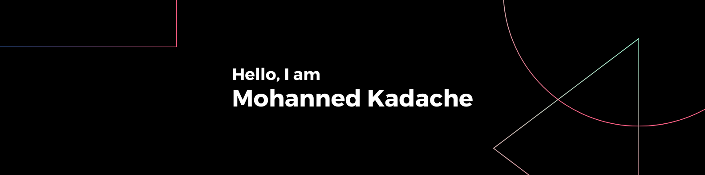

### Some Me

* **AI** and **Data Science** major at the **National Higher School of Artificial Intelligence (ENSIA)**. 

* **</> Software** Developer. 

* I am currently learning more about Artificial Intelligence in general, and always open to **new opportunities**. 

* Fun fact about me: I hate **losing :)**.

* Reach out to me: **mohanned.kadache@gmail.com** or use these social links:

### Social Links

### Tech Stack

### Some Statistics

<table align="center" style="border-collapse: collapse; border: 1px solid #A1CDF2;">
  <tr>
    <td align="center" style="padding: 10px; border: 1px solid #A1CDF2;">
      
    </td>
    <td align="center" style="padding: 10px; border: 1px solid #A1CDF2;">
      
    </td>
  </tr>
  <tr>
    <td align="center" style="padding: 10px; border: 1px solid #A1CDF2;">
      
    </td>
    <td align="center" style="padding: 10px; border: 1px solid #A1CDF2;">
      
    </td>
  </tr>
  <tr>
    <td colspan="2" align="center" style="padding: 10px; border: 1px solid #A1CDF2;">
      
    </td>
  </tr>
</table>

  

###
